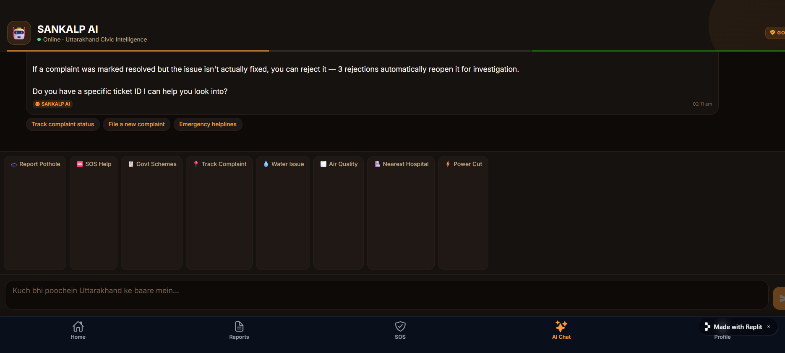
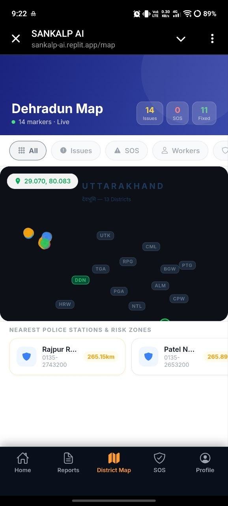
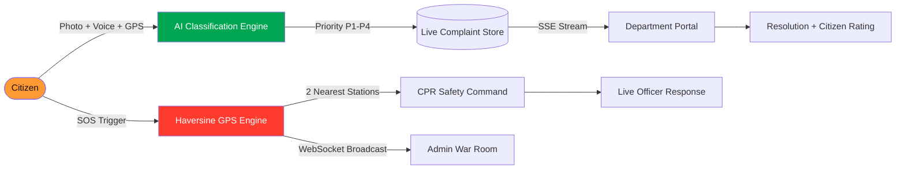
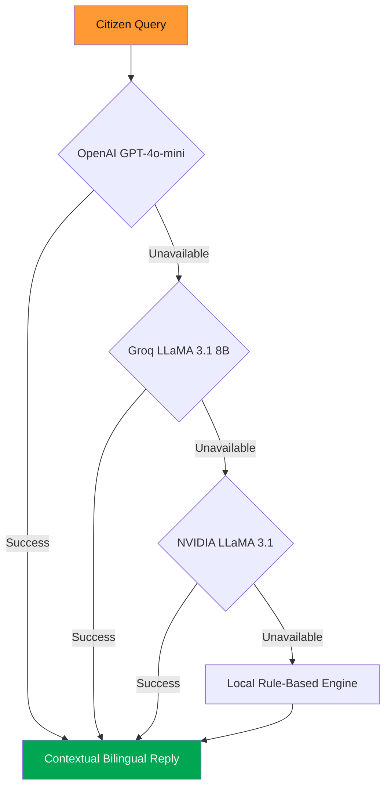
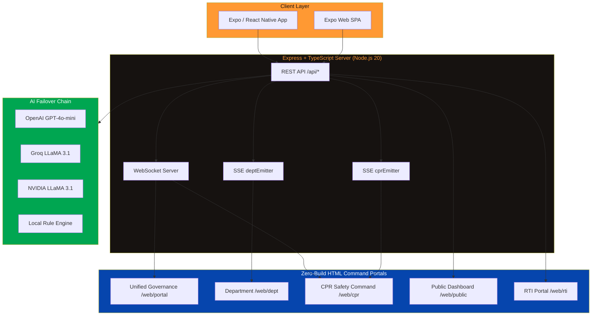

<div align="center">


<br/>


<br/><br/>

[](https://github.com/chilkotiKartik)
[](#license--legal-notice)
[](#)

<br/>


</div>

<br/>


<h3 align="center">
SANKALP <i>(संकल्प)</i> — Sanskrit for "Resolve / Pledge / Commitment"
</h3>
<p align="center">
A civic operating system built on a single pledge: every citizen of Uttarakhand deserves a government that listens instantly — and an app that acts even faster.
</p>

---

## Table of Contents

<details>
<summary>Expand full navigation</summary>

- [Overview](#overview)
- [Live Preview](#live-preview)
- [Core Concept](#core-concept)
- [Signature Features](#signature-features)
  - [Women Safety — 5 Independent Panic Triggers](#women-safety--5-independent-panic-triggers)
  - [Live GPS Engine](#live-gps-engine)
  - [Interactive Uttarakhand Command Map](#interactive-uttarakhand-command-map)
  - [AI Civic Assistant — 4-Tier Failover](#ai-civic-assistant--4-tier-failover)
  - [Smart Complaint Management](#smart-complaint-management)
  - [Gamification & Leaderboard](#gamification--leaderboard)
  - [Five Web Command Portals](#five-web-command-portals)
  - [Ward Health Score Engine](#ward-health-score-engine)
  - [Real-Time Infrastructure](#real-time-infrastructure)
  - [Emergency Directory](#emergency-directory)
  - [Bilingual Intelligence](#bilingual-intelligence)
  - [RTI Filing Module](#rti-filing-module)
  - [Budget Transparency Ledger](#budget-transparency-ledger)
  - [Security Architecture](#security-architecture)
- [System Architecture](#system-architecture)
- [Tech Stack](#tech-stack)
- [Folder Structure](#folder-structure)
- [Getting Started](#getting-started)
- [Environment Variables](#environment-variables)
- [Demo Credentials](#demo-credentials)
- [Deployment](#deployment)
- [Building the Android APK](#building-the-android-apk)
- [Roadmap](#roadmap)
- [Comparison](#comparison)
- [Author & Credits](#author--credits)
- [License & Legal Notice](#license--legal-notice)
- [Star History](#star-history)

</details>

---

## Overview

**SANKALP AI** is a production-grade, AI-first civic governance platform built for all **13 districts of Uttarakhand** — Dehradun, Haridwar, Tehri Garhwal, Pauri Garhwal, Rudraprayag, Chamoli, Uttarkashi, Pithoragarh, Bageshwar, Almora, Champawat, Nainital, and Udham Singh Nagar.

It is not a complaint box. It is a full civic operating system that fuses live GPS, emergency SOS, conversational AI, real-time mapping, multi-department command portals, civic gamification, RTI automation, and budget transparency into **one mobile app and five web command portals**, wired together in real time over WebSockets and Server-Sent Events.

---

## Live Preview

<div align="center">

| AI Civic Assistant | Live District Map |
|:---:|:---:|
|  |  |
| Bilingual GPT-4o-mini chat with live civic data injected into every reply | All 13 districts, live markers, police stations, and risk zones — centered on real GPS, never hardcoded |

</div>

> Replace the images above with your own screen recordings in `docs/media/` — a capture of the 6-tap SOS trigger firing, the AI responding live, or the admin War Room updating in real time will demonstrate the platform far better than static screenshots.

---

## Core Concept



Every module — the map, the AI, the SOS system, the leaderboard — feeds one mission: turn every citizen's phone into a direct, real-time line to the people who can actually fix the problem.

---

## Signature Features

### Women Safety — 5 Independent Panic Triggers

The flagship system, designed so help can be summoned even without looking at the screen.

<div align="center">

| # | Trigger | Mechanism | Fires In |
|:-:|---------|-----------|:--------:|
| 1 | 6-Tap | Tap the shield card six times | 3 seconds |
| 2 | Long-Hold | Hold the shield; ring fills live | 2 seconds |
| 3 | Volume Button | On-screen hardware-styled key, six presses | 4 seconds |
| 4 | Shake | Accelerometer-based, five rapid shakes (native) | Instant |
| 5 | Voice | Say "help me" or "bachao" (native) | Instant |

</div>

**On trigger, the full cascade fires in under a second:**

```
Voice alert plays        SOS vibration pattern         Live GPS captured (HIGH accuracy)
2 nearest police notified   18-second audio evidence saved   WebSocket broadcast to all admin portals
```

Distance is calculated with a real Haversine-formula implementation across **28 real police stations** — not a mock lookup.

---

### Live GPS Engine

No demo tricks, no hardcoded "New Delhi" fallback for a citizen sitting in Champawat.

- **Native** — `expo-location` → `watchPositionAsync` (5s interval / 10m threshold)
- **Web** — `navigator.geolocation.watchPosition` (high accuracy)
- **Fallback chain** — real GPS, then the citizen's own registered district centre (never a random default)
- **SOS live tracking** — position pushed to admin dashboards every 5 seconds during an active alert
- **Map recenter** — snaps to the actual live position, not a static pin

---

### Interactive Uttarakhand Command Map

A full Leaflet.js map (CartoDB tiles) with seven filterable live layers:

<div align="center">

`All`  ·  `Issues (P1-P4)`  ·  `SOS`  ·  `Workers`  ·  `Police (28 stations)`  ·  `Risk Zones`  ·  `Hospitals`  ·  `Fire Stations`

</div>

Tap any pin for one-touch calling. The GPS dot is always live — this map tracks the citizen, not the other way around.

---

### AI Civic Assistant — 4-Tier Failover



Zero downtime, by design. Every reply is injected live with:

- The citizen's district complaint count, resolution rate, and active SOS count
- Best and worst ward health scores, in real time
- Real helplines — UPCL `1912`, Jal Sansthan `1916`, PWD `1800-180-4244`
- Scheme details — CM Swarojgar, Gaura Devi Kanya Dhan (₹51,000 for girls), Ayushman Bharat
- Char Dham route conditions and disaster contacts
- AI photo analysis — a photo of a civic issue returns instant severity, department, and P1–P4 priority

The tone is warm and naturally bilingual — *Namaste, ji, Devbhoomi, dhanyavaad* — never robotic, always under 250 words, with safety numbers surfaced first whenever risk is detected.

---

### Smart Complaint Management

<div align="center">

| Capability | Detail |
|---|---|
| Categories | Pothole, Garbage, Streetlight, Water, Drain/Sewer, Electricity, Tree/Park, Other |
| AI Photo Analysis | Auto-fills severity, category, and priority from a single photo |
| Ticket System | Unique trackable IDs, e.g. `CMP-A3F2E1` |
| Live Status | `pending → in_progress → resolved`, with admin notes at every step |
| Civic Upvotes | Citizens escalate high-impact issues themselves |
| Resolution Loop | 1–5 star rating plus a mandatory "after" photo |
| Instant Routing | SSE pushes the ticket into the correct department portal the moment it is filed |

</div>

---

### Gamification & Leaderboard

A 20-citizen leaderboard spanning all 13 districts, with points for filing, resolving, upvoting, and community engagement. Levels 1–10, badges (First Report, Active Citizen, Civic Hero, City Champion), and the citizen's own row highlighted with a "You" badge.

---

### Five Web Command Portals

Zero-build React 18 portals (CDN + Babel Standalone) — deploy-anywhere HTML, no bundler required.

<div align="center">

| Portal | Route | Purpose |
|---|---|---|
| Unified Governance Portal | `/web/portal` | Full admin command — complaints, SOS, workers, analytics, broadcast |
| Department Portal | `/web/dept` | Live SSE stream, complaints appear the instant they arrive. Access: `{deptId}_2026` |
| CPR Safety Command | `/web/cpr` | 15 patrol vans on a live map, plus officer leaderboard |
| Public Civic Dashboard | `/web/public` | No-login live transparency stats for press and public |
| RTI Filing Portal | `/web/rti` | AI-drafted RTI applications with 30-day deadline tracking |

</div>

---

### Ward Health Score Engine

Every ward carries a live 0–100 health score, computed from open complaint density, resolution rate, active SOS count, and population weighting — surfaced on the home screen, the map, and injected directly into every AI conversation.

---

### Real-Time Infrastructure

<div align="center">

| Channel | Purpose |
|---|---|
| WebSocket Server | Instant SOS broadcast to every connected portal and app |
| SSE `deptEmitter` | Complaints stream live into Department Portals |
| SSE `cprEmitter` | SOS and patrol GPS stream live into CPR Command |
| Worker GPS Stream | Live field-worker movement via `/api/workers/stream` |
| Expo Push Notifications | Complaint status updates delivered to the citizen's phone |

</div>

---

### Emergency Directory

A one-tap quick-dial grid — `112` `100` `108` `1090` `1070` `1905` — plus a tabbed directory of Police, Medical, Fire, Disaster, and Helplines, with district hospitals and fire stations mapped and callable directly.

---

### Bilingual Intelligence

The AI mixes Hindi naturally into every reply. Voice alerts speak `en-IN` Indian English. Hindi keywords — नमस्ते, पानी, बिजली, महिला — are understood natively, with every district, ward, and helpline mapped to real Uttarakhand context.

---

### RTI Filing Module

A plain-language description becomes a full AI-drafted RTI application, with the statutory 30-day deadline tracked automatically and status moving through `filed → acknowledged → replied → closed`.

---

### Budget Transparency Ledger

104 real budget line items across all 13 districts — allocated versus spent, visualised with percentage bars, filterable by district and department.

---

### Security Architecture

<div align="center">

| Layer | Implementation |
|---|---|
| Auth | Phone + 6-digit PIN |
| Tokens | JWT, 24-hour expiry |
| Roles | `citizen`, `district_admin`, `super_admin` |
| Rate Limiting | AI at 30 req/min, SOS at 10 req/min |
| Middleware | Every route protected by auth middleware |

</div>

---

## System Architecture



---

## Tech Stack

<div align="center">


</div>

<div align="center">

| Layer | Technology |
|:--|:--|
| Mobile App | Expo ~54 + React Native 0.81.5 + Expo Router v6 (file-based routing) |
| Web Portals | React 18 via CDN + Babel Standalone — zero build step |
| Backend | Express.js 5 + TypeScript on Node.js 20 |
| Database | In-memory store, with the interface already ready for PostgreSQL via Drizzle ORM |
| Maps | Leaflet.js 1.9.4 + CartoDB Light tiles + `react-native-maps` |
| AI | OpenAI GPT-4o-mini → Groq LLaMA 3.1 8B → NVIDIA LLaMA 3.1 → Local engine |
| Real-Time | WebSocket (`ws`) + Server-Sent Events (Node `EventEmitter`) |
| Push | Expo Push Notifications Server SDK |
| Voice | `expo-speech` (TTS) + `expo-av` (recording) |
| GPS | `expo-location` (native) + `navigator.geolocation` (web) |
| Animation | React Native Reanimated 4 + Animated API (60fps) |
| Auth | JWT (24h) + bcrypt (12 salt rounds) |

</div>

---

## Folder Structure

```text
sankalp-ai/
├── app/                          # Expo Router — file-based navigation
│   ├── (auth)/                   #   Login, Register, Onboarding
│   ├── (tabs)/                   #   Home, Complaints, Map, SOS, AI, Wards,
│   │                              #   RTI, Budget, Community, Leaderboard...
│   └── admin/                    #   War Room, Alerts, Reports, Workers,
│                                  #   Departments, Super Admin, Audit Log
├── components/                   # Reusable UI — Maps, Cards, Badges, Animations
├── context/                      # Global state — Auth, App, Language, Notifications
├── constants/                    # Design tokens — colors.ts, districts.ts (13 UK districts)
├── lib/                          # Leaflet bundle, map HTML generators, query client
├── server/                       # Express backend
│   ├── index.ts                  #   Server entrypoint + WebSocket bootstrap
│   ├── routes.ts                 #   Every REST endpoint
│   ├── storage.ts                #   Data layer — police stations, complaints, workers
│   └── web/                      #   The five zero-build HTML command portals
├── shared/                       # Shared Zod schemas + Drizzle models
├── scripts/build.js              # Builds the Expo web bundle for production
└── assets/ · attached_assets/    # Icons, splash art, and product screenshots
```

---

## Getting Started

```bash
# Clone the repository
git clone https://github.com/chilkotiKartik/sankalp-ai.git
cd sankalp-ai

# Install dependencies
npm install

# Set environment variables (see below)
cp .env.example .env

# Run the backend — Express + WebSocket, port 5000
npm run server:dev

# In a second terminal, run the Expo app
npm start
```

Scan the printed QR code with Expo Go on a physical device, or press `w` to launch instantly in the browser.

---

## Environment Variables

<div align="center">

| Variable | Purpose | Required |
|---|---|:---:|
| `EXPO_PUBLIC_DOMAIN` | Production domain for the Expo web bundle | Yes |
| `GROQ_API_KEY` | Primary AI engine (LLaMA 3.1 8B) | Yes — minimum one AI key |
| `NVIDIA_API_KEY` | Secondary AI + RTI draft generation | Recommended |
| `OPENAI_API_KEY` | Tertiary AI fallback (GPT-4o-mini) | Optional |
| `SESSION_SECRET` | Express / JWT session signing secret | Yes |

</div>

---

## Demo Credentials

<div align="center">

| Role | Phone | PIN / Code |
|---|:---:|:---:|
| Citizen — Champawat, Rank #17 | `9876543210` | `123456` |
| Super Admin | `9999999999` | `000000` |
| Dept Portal — PWD | — | `pwd_2026` |
| Dept Portal — Police | — | `police_2026` |
| CPR Safety Command | — | `cpr_2026` |

</div>

Tap the SANKALP logo on the login screen five times to reveal the admin gateway.

---

## Deployment

```bash
node scripts/build.js     # Builds the Expo web bundle -> static-build/web/
npm run server:build      # Bundles the Express server -> server_dist/
npm run server:prod       # Serves everything from a single Node process
```

The Express server serves everything from one process — `/api/*` for REST and WebSocket, `/web/*` for the five HTML command portals, and `/*` for the Expo web SPA. One deploy, one URL, five command centers.

Full step-by-step guides live in [`DEPLOY.md`](./DEPLOY.md), [`DEPLOYMENT_GUIDE.md`](./DEPLOYMENT_GUIDE.md), and [`DEPLOY_RAILWAY.md`](./DEPLOY_RAILWAY.md).

---

## Building the Android APK

```bash
npm install -g eas-cli
eas login
eas build --platform android --profile apk
```

Full guide with prerequisites and troubleshooting: [`APK_BUILD_GUIDE.md`](./APK_BUILD_GUIDE.md) · [`EXPO_GO_DEPLOYMENT.md`](./EXPO_GO_DEPLOYMENT.md)

---

## Roadmap

- Migrate the in-memory store to a managed PostgreSQL instance (Drizzle schema already production-ready)
- Integrate live CPCB AQI sensor data
- Offline-first mode with SQLite and background sync
- Full voice-first complaint filing
- Video evidence upload for complaints and SOS
- Expand beyond Hindi and English to Garhwali and Kumaoni
- A dedicated Ward Officer companion app on the same backend
- Deeper analytics dashboards with trend forecasting

---

## Comparison

<div align="center">

| Capability | SANKALP AI | Typical Civic App |
|---|:---:|:---:|
| Real-time AI complaint classification | Yes | No |
| Five-method Women Safety SOS system | Yes | No |
| Live GPS police-station matching (Haversine) | Yes | No |
| Real-time admin war room over WebSocket | Yes | Email only |
| Dynamic 0–100 ward health scoring | Yes | No |
| Bilingual conversational AI with live civic data | Yes | No |
| Five dedicated command portals | Yes | No |
| Citizen gamification and leaderboard | Yes | No |
| Budget transparency ledger | Yes | No |

</div>

---

## Author & Credits

<div align="center">

### Conceived, designed, and engineered end-to-end by

# Kartik Chilkoti

*Founder, Architect, and Full-Stack Engineer of SANKALP AI*

[](https://github.com/chilkotiKartik)

</div>

Every line of code, every system design decision, and every feature in this platform — from the five-trigger SOS engine, to the four-tier AI failover chain, to the five real-time command portals — was designed and built by **Kartik Chilkoti**.

> जन सेवा ही राष्ट्र सेवा है — "Service to the people is service to the nation."
> Built with resolve, for Devbhoomi Uttarakhand.

---

## License & Legal Notice

<div align="center">


</div>

This repository, SANKALP AI, and all associated source code, architecture, design assets, branding, and documentation contained herein are the original creation and sole property of **Kartik Chilkoti**.

- Full credit for this project belongs exclusively to Kartik Chilkoti.
- Unauthorized copying, redistribution, rebranding, or commercial use of this codebase without explicit written permission and proper attribution to Kartik Chilkoti is strictly prohibited.
- Any misuse, plagiarism, unauthorized claim of authorship, or copyright infringement related to this project may result in formal legal action under applicable copyright and intellectual property law.
- For licensing inquiries, collaboration, or permission requests, reach out via [GitHub](https://github.com/chilkotiKartik).

All third-party libraries, frameworks, and APIs used within this project — Expo, React Native, OpenAI, Groq, NVIDIA, Leaflet, and others — remain the property of their respective owners and are used strictly under their own applicable licenses.

---

## Star History

<div align="center">

[](https://star-history.com/#chilkotiKartik/sankalp-ai&Date)

If SANKALP AI is useful to you, consider giving it a star — it costs nothing and means a great deal to a solo builder.

</div>

<br/>


<p align="center"><sub>© 2026 Kartik Chilkoti · SANKALP AI · Built for Devbhoomi Uttarakhand</sub></p>
